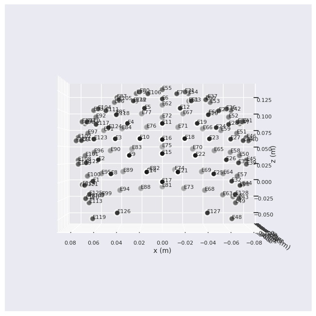
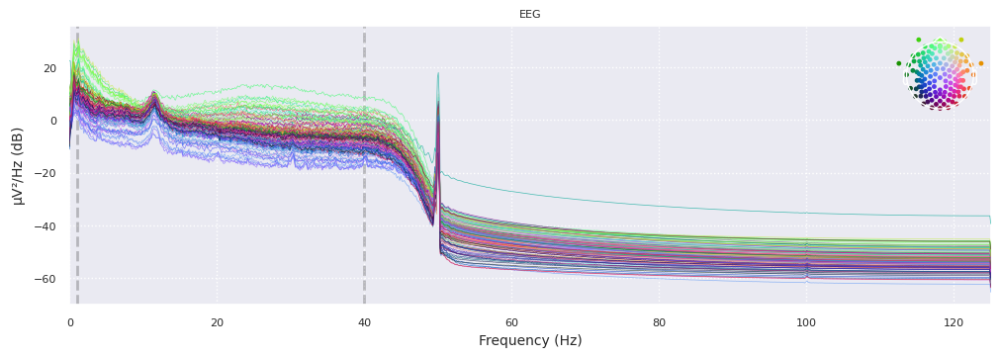

# Depression Detection via EEG & Emotional Analysis

This project explores the detection of Major Depressive Disorder (MDD) by analyzing brain activity (EEG signals) recorded during different emotional states. It implements feature extraction and modelling on the EEG Signals to determine depressed states based on 3 emotional channels: happy, sad and fear.

Dataset Link: MODMA Dataset [https://modma.lzu.edu.cn/data/application/]

# Depression Detection via EEG & Emotional Analysis

This project explores the detection of Major Depressive Disorder (MDD) by analyzing brain activity (EEG signals) recorded during different emotional states.

## Project Structure

The workflow is divided into two main stages, each contained within a dedicated Jupyter notebook:

### 1. Feature Extraction (`feature_extraction.ipynb`)
This notebook handles the **Data Processing** phase, transforming raw biological signals into structured data for machine learning.
* **Goal:** Process raw EEG data to extract biomarkers that indicate depression.
* **Methodology:**
    * **Signal Processing:** Utilizes `mne` and `scipy` to clean and analyze raw brainwave signals.
    * **Feature Engineering:** Extracts **Linear Features** (statistics of alpha, beta, and theta waves) and **Non-Linear Features** (complexity and entropy measures using the `antropy` library).
    * **Emotional Categorization:** Features are organized and extracted based on three specific emotional triggers: **Happy**, **Sad**, and **Fear**.
 

*Figure 1: Visualization of 128 EEG ERP channels*

*Figure 2: EEG Signals before and after signal processing*

### 2. Model Development (`Create_Model.ipynb`)
This notebook handles the **Machine Learning** phase, where the processed features are used to train and evaluate predictive models.
* **Goal:** Build a tool to accurately predict MDD based on emotional responses and clinical data.
* **Methodology:**
    * **Data Integration:** Merges extracted EEG features with patient demographics (age, gender, education) and clinical depression scores (PHQ-9).
    * **Classifiers:** Evaluates multiple algorithms including **Random Forest**, **Logistic Regression**, **K-Nearest Neighbors (KNN)**, and **Support Vector Classifiers (SVC)**.
    * **Deep Learning:** Implements an **RNN with GRU (Gated Recurrent Unit)** to capture temporal patterns in the data.
* **Key Results:**
    * The **Random Forest** algorithm achieved the highest performance with **80% accuracy** when specifically using features from the **"Sad"** emotional state.
    * The **RNN/GRU** model reached a training accuracy of 90% and a testing accuracy of 71%.
    * **Conclusion:** The analysis confirms that "Sad" emotional responses are the most significant biological markers for diagnosing depression in this dataset.

## Requirements
The project relies on the following key Python libraries:
* `mne` (EEG signal processing)
* `antropy` (Complexity/Entropy features)
* `scikit-learn` (Machine Learning models)
* `tensorflow`/`keras` (RNN/GRU implementation)
* `pandas`/`numpy` (Data manipulation)

